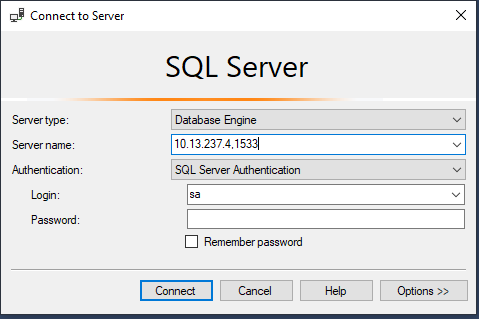

# MS SQL Server


:one: Creer un répertoire avec comme nom votre :id:

:two: Copier les fichiers se trouvant dans le repretoire `.src` dans votre répertoire

`$ cp -r .src/* `:id:` `

:three: Dans votre répertoire, construire l'image `Docker`

```
$ docker build --tag mssql-server-windows-developer-fti .
```

:four: Demarrer le conteneur

```
$ docker container run --name some-mssql `
                       --env "SA_PASSWORD=Password123" `
                       --publish 1533:1433 --detach `
                       mssql-server-windows-developer-fti
```

:b: Test

* Install SQL-SERVER Management Studio (SSMS) using `choco` in Admin Level

```
PS > choco install ssms
```

https://github.com/pulla2908/docker-mssql-server-windows-developer-fti


# References

https://hub.docker.com/r/microsoft/mssql-server-windows-express

Installer MS SQL Server

```
PS > docker container run --name some-mssql `
                          --env sa_password=password --env ACCEPT_EULA=Y `
                          --publish 1433:1433 --detach `
                          microsoft/mssql-server-windows-express
```


```
PS > New-NetFirewallRule -DisplayName 'MSSQL Inbound' -Profile @('Domain', 'Public', 'Private') -Direction Inbound -Action Allow -Protocol TCP -LocalPort 1533
```



