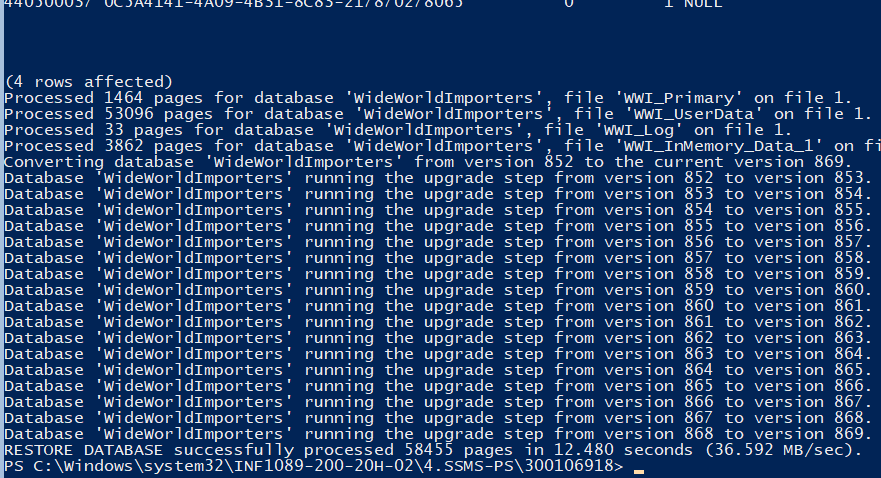
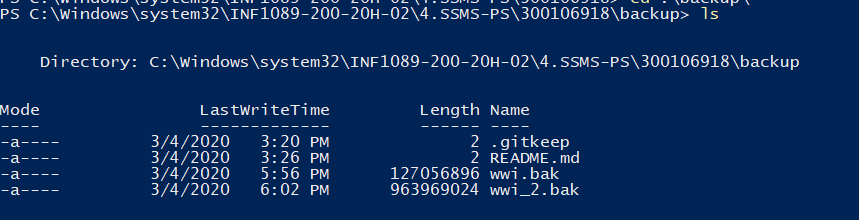

# Powershell SQL Backup and restore script 


##  Création du container MSSQL

👁 Aller dans le repertoire de son :id: et creer un répertoire `backup` et y mettre le fichier `.gitkeep`

```
PS> mkdir backup
PS> echo $null >> backup\.gitkeep
```

😎 Capturer le répertoire courant `$PWD` et le placer dans la variable d'environnement `$SRC`

```
PS> $SRC = (pwd).Path | Foreach-Object {$_ -replace '\\','/'}
```

🚓 Lancer le conteneur avec une gestion d'état `--volume`

🆗 Le paramètre Docker `--volume` représente l'état à capturer et prend une source et une destination

```
PS> docker container run --name some-mssql `
           --env "ACCEPT_EULA=Y" `
           --env "SA_PASSWORD=Password123" `
           --volume ${SRC}:C:/DATA `
           --publish 1433:1433 --detach `
           mssql-server-windows-developer-fti
```

💥 Restore Database

🕠 Dans son répertoire de travail (i.e. :id: )

* Lancer son script de restauration

```
PS > .\restore.ps1
``` 


👉 Vérification dans `SSMS` 

* La base de donnees `WorldWideImporters` a été importée

</img>

🤷‍♀️ Backup Database

:pushpin: Dans son répertoire de travail (i.e. :id: )

* Lancer son script de backup

```
PS > .\backup.ps1
```

🤦‍♂️ Vérification

```
PS > gci backup
```


* le fichier `wwwi_2.bak` doit ètre présent 

