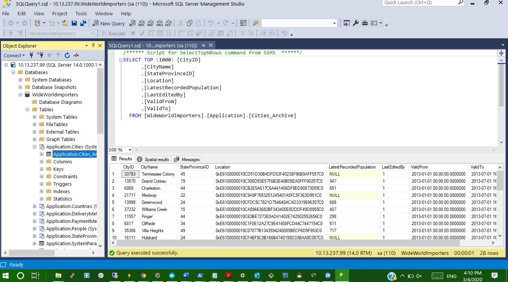

# Laboratoire : Création d’un plan de maintenance MSSQL - Simulation

*  [x] Creer deux fichiers powershell dans lesquelles on va ajouter les instructions a suivre pour importer une base de donnee existante par un `restore` et ensuite faire un `backup` de cette base de donnee.

1- [restore.ps1](restore.ps1)

2- [backup.ps1](backup.ps1)


## :a: Création du container MSSQL [x]

:pushpin: Aller dans le repertoire de son :id: et creer un répertoire `backup` et y mettre le fichier `.gitkeep`

```
PS C:\users\Administrator\Developer\INF1089-200-20H-02\4.SSMS-PS\300107361> mkdir backup
PS C:\users\Administrator\Developer\INF1089-200-20H-02\4.SSMS-PS\300107361> echo $null >> backup\.gitkeep
```

:pushpin: Capturer le répertoire courant `$PWD` et le placer dans la variable d'environnement `$SRC`

```
PS C:\users\Administrator\Developer\INF1089-200-20H-02\4.SSMS-PS\300107361> $SRC = (pwd).Path | Foreach-Object {$_ -replace '\\','/'}
PS C:\users\Administrator\Developer\INF1089-200-20H-02\4.SSMS-PS\300107361> $SRC
C:/users/Administrator/Developer/INF1089-200-20H-02/4.SSMS-PS/300107361
```

:m: Lancer le conteneur avec une gestion d'état `--volume`  [x]

:bulb: Le paramètre Docker `--volume` représente l'état à capturer et prend une source et une destination

```
PS> docker container run --name some-mssql `
           --env "ACCEPT_EULA=Y" `
           --env "SA_PASSWORD=Password123" `
           --volume ${SRC}:C:/DATA `
           --publish 1433:1433 --detach `
           mssql-server-windows-developer-fti
```

## :b: Restore Database [x]

:pushpin: Dans son répertoire de travail (i.e. :id: )

* Lancer son script de restauration

```
PS C:\users\Administrator\Developer\INF1089-200-20H-02\4.SSMS-PS\300107361> .\restore.ps1

Processed 1464 pages for database 'WideWorldImporters', file 'WWI_Primary' on file 1.
Processed 53096 pages for database 'WideWorldImporters', file 'WWI_UserData' on file 1.
Processed 33 pages for database 'WideWorldImporters', file 'WWI_Log' on file 1.
Processed 3862 pages for database 'WideWorldImporters', file 'WWI_InMemory_Data_1' on file 1.
Converting database 'WideWorldImporters' from version 852 to the current version 869.
Database 'WideWorldImporters' running the upgrade step from version 852 to version 853.
Database 'WideWorldImporters' running the upgrade step from version 853 to version 854.
Database 'WideWorldImporters' running the upgrade step from version 854 to version 855.
Database 'WideWorldImporters' running the upgrade step from version 855 to version 856.
Database 'WideWorldImporters' running the upgrade step from version 856 to version 857.
Database 'WideWorldImporters' running the upgrade step from version 857 to version 858.
Database 'WideWorldImporters' running the upgrade step from version 858 to version 859.
Database 'WideWorldImporters' running the upgrade step from version 859 to version 860.
Database 'WideWorldImporters' running the upgrade step from version 860 to version 861.
Database 'WideWorldImporters' running the upgrade step from version 861 to version 862.
Database 'WideWorldImporters' running the upgrade step from version 862 to version 863.
Database 'WideWorldImporters' running the upgrade step from version 863 to version 864.
Database 'WideWorldImporters' running the upgrade step from version 864 to version 865.
Database 'WideWorldImporters' running the upgrade step from version 865 to version 866.
Database 'WideWorldImporters' running the upgrade step from version 866 to version 867.
Database 'WideWorldImporters' running the upgrade step from version 867 to version 868.
Database 'WideWorldImporters' running the upgrade step from version 868 to version 869.
RESTORE DATABASE successfully processed 58455 pages in 17.313 seconds (26.377 MB/sec).
```

:pushpin: Vérification dans `SSMS`  [x]

* La base de donnees `WorldWideImporters` a été importée

</img>

## :ab: Backup Database  [x]

:pushpin: Dans son répertoire de travail (i.e. :id: )

* Lancer son script de backup

```
PS C:\users\Administrator\Developer\INF1089-200-20H-02\4.SSMS-PS\300107361> .\backup.ps1

10 percent processed.
20 percent processed.
30 percent processed.
Processed 1488 pages for database 'WideWorldImporters', file 'WWI_Primary' on file 1.
Processed 53096 pages for database 'WideWorldImporters', file 'WWI_UserData' on file 1.
Processed 3865 pages for database 'WideWorldImporters', file 'WWI_InMemory_Data_1' on file 1.
Processed 72 pages for database 'WideWorldImporters', file 'WWI_Log' on file 1.
100 percent processed.
BACKUP DATABASE successfully processed 58521 pages in 24.778 seconds (18.451 MB/sec) .
```

:pushpin: Vérification

```
PS C:\users\Administrator\Developer\INF1089-200-20H-02\4.SSMS-PS\300107361\backup> ls
```

* le fichier `wwwi_2.bak` doit ètre présent  [x]

```


    Directory: C:\users\Administrator\Developer\INF1089-200-20H-02\4.SSMS-PS\300107361\backup


Mode                LastWriteTime         Length Name
----                -------------         ------ ----
-a----         3/4/2020  12:41 PM              2 .gitkeep
-a----         3/4/2020   1:07 PM      127056896 wwi.bak
-a----         3/4/2020   1:18 PM      482021376 wwi_2.bak


```
