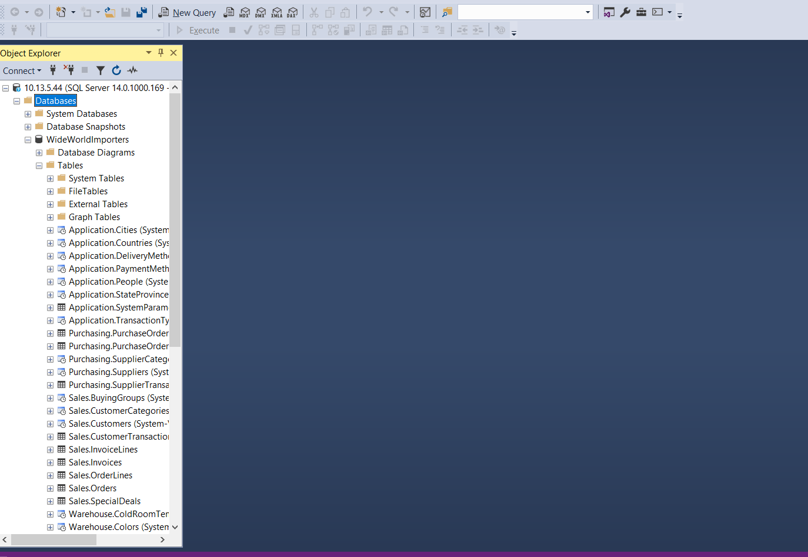

                   📗 Laboratoire : Création d’un plan de maintenance MSSQL       
        
        
  ✏ SQL server management Backup and restore script
        
   
 ✔  Création du container MSSQL
   
   PS> mkdir backup
   
   PS> echo $null >> backup\.gitkeep
   
 ✔  Capturer le répertoire courant $PWD et le placer dans la variable d'environnement $SRC
   
   PS> $SRC = (pwd).Path | Foreach-Object {$_ -replace '\\','/'}
   
 ✔  Lancer le container avec une gestion d'etat --volume 

  PS> docker container run --name some-mssql `
           --env "ACCEPT_EULA=Y" `
           --env "SA_PASSWORD=Password123" `
           --volume ${SRC}:C:/DATA `
           --publish 1433:1433 --detach `
           mssql-server-windows-developer-fti
           
  ✔ Restore Database
  
 ✏ Dans son répertoire de travail (i.e. 🆔 )
     
 ✏ Lancer son script de restauration
     
   PS > .\restore.ps1
   
   </img>
   
  Vérification dans SSMS

La base de donnees WorldWideImporters a été importée
  
   ✔ Backup Database
  
✏ Dans son répertoire de travail (i.e. 🆔 )

✏ Lancer son script de backup

PS > .\backup.ps1

 ✔ Vérification
  
  PS > gci backup
  
  le fichier wwwi_2.bak doit ètre présent

