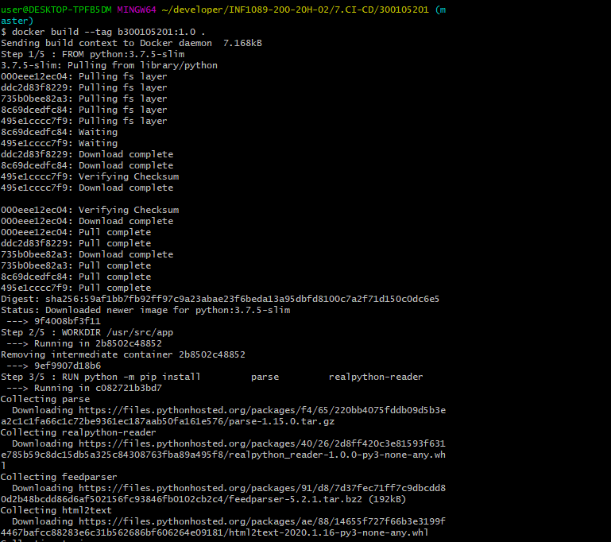
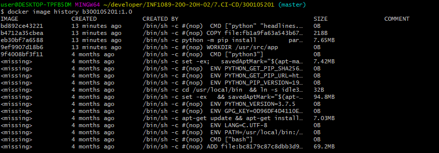

# :seven: CI/CD Batch

Ce laboratoire t'apprendra à utiliser les commandes `shell` sous Unix en créant un fichier `entrypoint.sh`, à créer ton propre conteneur `Docker` en créant un fichier `Dockerfile` et t'apprendra les bases du [`CI/CD`](https://en.wikipedia.org/wiki/CI/CD) `Continuous Integration` et `Continuous Delivery` avec le service `github actions` de `github.com`.

Une section [Indices](#fire-indices) est fournie ci-dessous comme documentation d'aide à terminer ce laboratoire.

Tu pourras t'appuyer d'une documentation en ligne pour continuer ce labobratoire en améliorant le fichier `Dockerfile` avec le [cours en ligne suivant](https://www.linkedin.com/learning/docker-essential-training-3-image-creation-management-and-registry/analyzing-a-dockerfile)

## :a: :id:

* Créer un répertoire avec votre :id:

* Créer votre fichier `README.md`

```
$ touch README.md
```

[Participation](Participation.md)

## :b: Laboratoire

:one: Écrire les scripts en suivant le laboratoire ci-dessous dans [Github Leaning Lab](https://lab.github.com/CollegeBoreal):

https://lab.github.com/CollegeBoreal/lab-github-actions:-bonjour-monde


:two: Copier votre scripts dans le cours en remplaçant :id: par votre :id: github :octocat: :

https://github.com/:id:/lab-bonjour-github-actions

- [x] Copier les scripts:

Par example:

  - [x] Copier le fichier `Dockerfile` dans votre :id: `Boréal` 

  - [x] Copier le fichier `entrypoint.sh` dans votre :id: `Boréal` 


- [x] Modifie ton fichier README.md pour plus de documentation


En un mot, récupérer le travail que vous avez fait à travers [Github Leaning Lab](https://lab.github.com/CollegeBoreal) et le mettre dans celui du cours [7.CI-CD](../7.CI-CD)


Le laboratoire vous garantit une note de :five::zero:`%`, ajouter du code en améliorant les scripts embellira la note.

En rappel, pour éxécuter localement son fichier `Dockerfile`, on execute la commande :

Pour ceci il faut rentrer d'abord dans le repertoire `action-a`

* $ cd action-a

* $ docker build --tag b300105201:1.0 .

</img>


Pour visualiser les couches images de l'image créée

* $ docker image history b300105201:1.0

</img>

