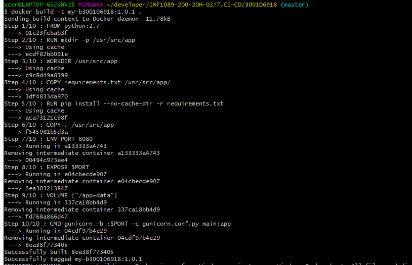
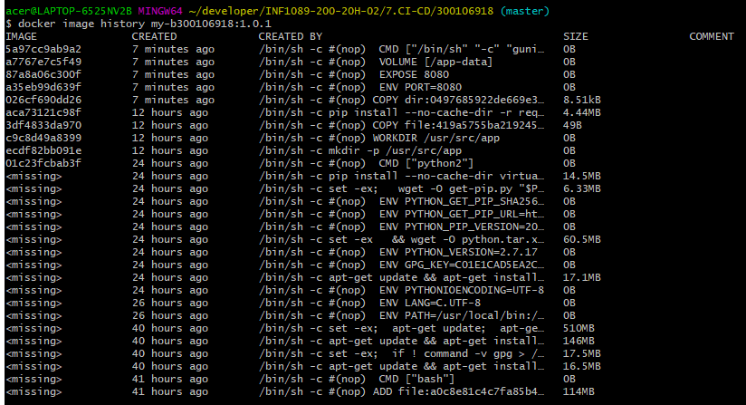
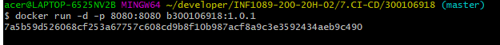
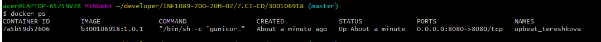
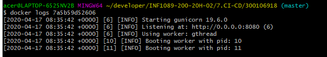
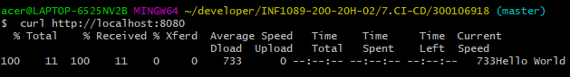
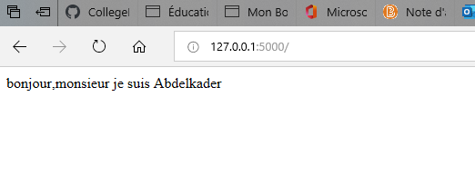

# python-dockerfile


#### Build your image

```
docker build -t my-b300106918:1.0.1 .
```
 
#### check all docker images
```
$ docker image history my-b300106918:1.0.1

```

 

#### Run your image
```
$ docker run -d -p 8080:8080 b300106918:1.0.1
```

 
You can use `docker ps` to list all running containers. 
```
$ docker ps

```
 


+ display logs in running container
```
$ docker logs 7a5b59d52606  

```
 


#### Test your application
```
$ curl http://localhost:8080
Hello World
```

 


#### Test
http://127.0.0.1:5000/ 


