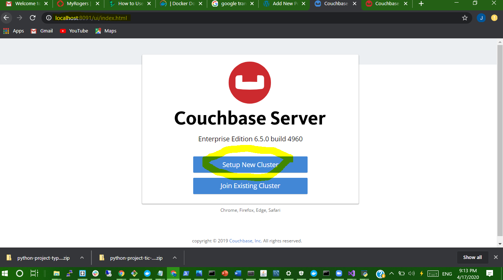
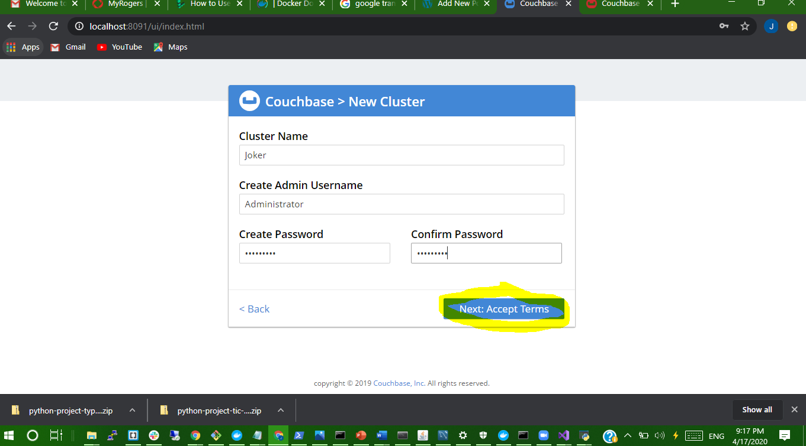
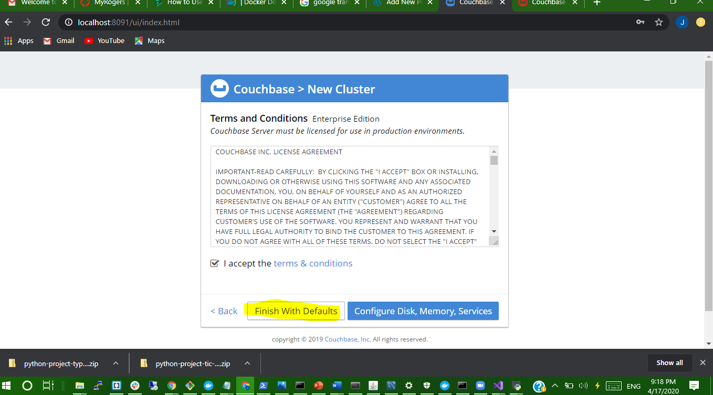
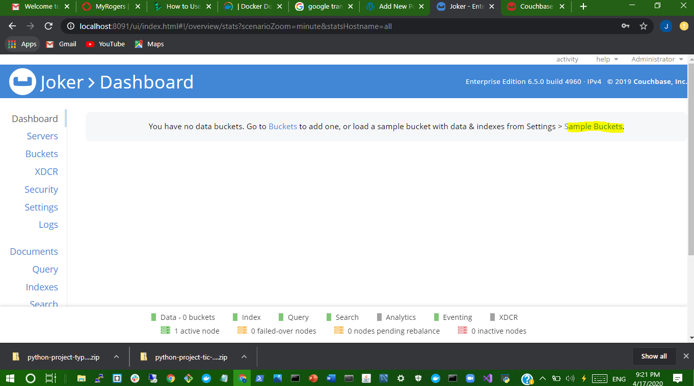

# :seven: CI/CD Batch

Ce laboratoire t'apprendra à utiliser les commandes `shell` sous Unix en créant un fichier `entrypoint.sh`, à créer ton propre conteneur `Docker` en créant un fichier `Dockerfile` et t'apprendra les bases du [`CI/CD`](https://en.wikipedia.org/wiki/CI/CD) `Continuous Integration` et `Continuous Delivery` avec le service `github actions` de `github.com`.

Une section [Indices](#fire-indices) est fournie ci-dessous comme documentation d'aide à terminer ce laboratoire.

Tu pourras t'appuyer d'une documentation en ligne pour continuer ce labobratoire en améliorant le fichier `Dockerfile` avec le [cours en ligne suivant](https://www.linkedin.com/learning/docker-essential-training-3-image-creation-management-and-registry/analyzing-a-dockerfile)

## :a: :id:

* Créer un répertoire avec votre :id:

* Créer votre fichier `README.md`

```
$ touch README.md
```

[Participation](Participation.md)

## :b: Laboratoire

:one: Écrire les scripts en suivant le laboratoire ci-dessous dans [Github Leaning Lab](https://lab.github.com/CollegeBoreal):

https://lab.github.com/CollegeBoreal/lab-github-actions:-bonjour-monde


:two: Copier votre scripts dans le cours en remplaçant :id: par votre :id: github :octocat: :

https://github.com/:id:/lab-bonjour-github-actions

- [x] Copier les scripts:

Par example:

  - [x] Copier le fichier `Dockerfile` dans votre :id: `Boréal` 

  - [x] Copier le fichier `entrypoint.sh` dans votre :id: `Boréal` 


- [x] Modifie ton fichier README.md pour plus de documentation


En un mot, récupérer le travail que vous avez fait à travers [Github Leaning Lab](https://lab.github.com/CollegeBoreal) et le mettre dans celui du cours [7.CI-CD](../7.CI-CD)

:three: Amélioration

* Le laboratoire vous garantit une note de :five::zero:`%`, ajouter du code en améliorant les scripts embellira la note.
* Pour l'amelioration je vais lancer un container docker Couchbase server en fonction d'un [Dockerfile](Dockerfile)
* [Couchbase Server](https://www.couchbase.com/products/server)est une base de données de documents NoSQL avec une architecture distribuée pour les performances, l'évolutivité et la disponibilité. Il permet aux développeurs de créer des applications plus facilement et plus rapidement en tirant parti de la puissance de SQL avec la flexibilité de JSON.


- [x] En rappel, pour éxécuter localement son fichier `Dockerfile`, on execute la commande :

`$ docker build --tag b`:id:`:1.0 .`

```
$ docker build --tag b300107361:6.5.0 .
Sending build context to Docker daemon   25.6kB
Step 1/20 : FROM ubuntu:16.04
16.04: Pulling from library/ubuntu
fe703b657a32: Pulling fs layer
f9df1fafd224: Pulling fs layer
a645a4b887f9: Pulling fs layer
57db7fe0b522: Pulling fs layer
57db7fe0b522: Waiting
f9df1fafd224: Verifying Checksum
f9df1fafd224: Download complete
a645a4b887f9: Verifying Checksum
a645a4b887f9: Download complete
57db7fe0b522: Verifying Checksum
57db7fe0b522: Download complete
fe703b657a32: Verifying Checksum
fe703b657a32: Download complete
fe703b657a32: Pull complete
f9df1fafd224: Pull complete
a645a4b887f9: Pull complete
57db7fe0b522: Pull complete
Digest: sha256:e9938f45e51d9ff46e2b05a62e0546d0f07489b7f22fbc5288defe760599e38a
Status: Downloaded newer image for ubuntu:16.04
Step 1/20 : FROM ubuntu:16.04
 ---> 77be327e4b63
Step 2/20 : MAINTAINER Couchbase Docker Team <docker@couchbase.com>
 ---> Using cache
 ---> b2b8832d76c2
Step 3/20 : RUN apt-get update &&     apt-get install -yq runit wget chrpath tzdata     lsof lshw sysstat net-tools numactl bzip2 &&     apt-get autoremove && apt-get clean &&     rm -rf /var/lib/apt/lists/* /tmp/* /var/tmp/*
 ---> Using cache
 ---> 98714ee29450
Step 4/20 : ARG CB_VERSION=6.5.0
 ---> Using cache
 ---> d87e15a86087
Step 5/20 : ARG CB_RELEASE_URL=https://packages.couchbase.com/releases/6.5.0
 ---> Using cache
 ---> ca0700bf59fc
Step 6/20 : ARG CB_PACKAGE=couchbase-server-community_6.5.0-ubuntu16.04_amd64.deb
 ---> Using cache
 ---> 4472f74ab0b5
Step 7/20 : ARG CB_SHA256=0b83b4861840392540c3c0b4f8ccc64f8f5adbebde4c05bd99b857dc3d528445
 ---> Using cache
 ---> 419f1d551cf2
Step 8/20 : ENV PATH=$PATH:/opt/couchbase/bin:/opt/couchbase/bin/tools:/opt/couchbase/bin/install
 ---> Using cache
 ---> d79e9e65096c
Step 9/20 : RUN groupadd -g 1000 couchbase && useradd couchbase -u 1000 -g couchbase -M
 ---> Using cache
 ---> 2bae98e5c87e
Step 10/20 : RUN export INSTALL_DONT_START_SERVER=1 &&     wget -N --no-verbose $CB_RELEASE_URL/$CB_PACKAGE &&     echo "$CB_SHA256  $CB_PACKAGE" | sha256sum -c - &&     dpkg -i ./$CB_PACKAGE && rm -f ./$CB_PACKAGE
 ---> Using cache
 ---> 620652e9559f
Step 11/20 : COPY scripts/run /etc/service/couchbase-server/run
 ---> Using cache
 ---> c17b3c9fc9a5
Step 12/20 : RUN chown -R couchbase:couchbase /etc/service
 ---> Using cache
 ---> cb098a23cbb7
Step 13/20 : COPY scripts/dummy.sh /usr/local/bin/
 ---> Using cache
 ---> 64c3a264e62f
Step 14/20 : RUN ln -s dummy.sh /usr/local/bin/iptables-save &&     ln -s dummy.sh /usr/local/bin/lvdisplay &&     ln -s dummy.sh /usr/local/bin/vgdisplay &&     ln -s dummy.sh /usr/local/bin/pvdisplay
 ---> Using cache
 ---> 60bdc670a1e6
Step 15/20 : RUN chrpath -r '$ORIGIN/../lib' /opt/couchbase/bin/curl
 ---> Using cache
 ---> 52d001492f3f
Step 16/20 : COPY scripts/entrypoint.sh /
 ---> Using cache
 ---> d810a6c5e37c
Step 17/20 : ENTRYPOINT ["/entrypoint.sh"]
 ---> Using cache
 ---> 7c79715902cc
Step 18/20 : CMD ["couchbase-server"]
 ---> Using cache
 ---> 2d13e37daf86
Step 19/20 : EXPOSE 8091 8092 8093 8094 8095 8096 11207 11210 11211 18091 18092 18093 18094 18095 18096
 ---> Using cache
 ---> 79c99e751316
Step 20/20 : VOLUME /opt/couchbase/var
 ---> Using cache
 ---> 4ed83652ab84
Successfully built 4ed83652ab84
Successfully tagged b300107361:6.5.0
SECURITY WARNING: You are building a Docker image from Windows against a non-Windows Docker host. All files and directories added to build context will have '-rwxr-xr-x' permissions. It is recommended to double check and reset permissions for sensitive files and directories.
```

# QuickStart avec Couchbase Server and Docker

Voici comment obtenir un cluster de serveurs Couchbase avec un seul nœud **node** exécuté sur Docker:

**Etape - 1 :** Lancer Couchbase Server docker container
```
$ docker run -d --name db -p 8091-8094:8091-8094 -p 11210:11210 couchbase
Unable to find image 'couchbase:latest' locally
latest: Pulling from library/couchbase
fe703b657a32: Already exists
f9df1fafd224: Already exists
a645a4b887f9: Already exists
57db7fe0b522: Already exists
37acf92bdab2: Pulling fs layer
10cf7308a312: Pulling fs layer
c45a9b3e71d6: Pulling fs layer
33af0d5a0317: Pulling fs layer
20304ddc2372: Pulling fs layer
12d5c28589d3: Pulling fs layer
50435a6426b6: Pulling fs layer
15a41097a0fb: Pulling fs layer
4416145aaa81: Pulling fs layer
20304ddc2372: Waiting
12d5c28589d3: Waiting
50435a6426b6: Waiting
15a41097a0fb: Waiting
4416145aaa81: Waiting
33af0d5a0317: Waiting
10cf7308a312: Download complete
33af0d5a0317: Verifying Checksum
33af0d5a0317: Download complete
37acf92bdab2: Verifying Checksum
37acf92bdab2: Download complete
20304ddc2372: Verifying Checksum
20304ddc2372: Download complete
12d5c28589d3: Verifying Checksum
12d5c28589d3: Download complete
50435a6426b6: Verifying Checksum
50435a6426b6: Download complete
15a41097a0fb: Verifying Checksum
15a41097a0fb: Download complete
4416145aaa81: Verifying Checksum
4416145aaa81: Download complete
37acf92bdab2: Pull complete
10cf7308a312: Pull complete
c45a9b3e71d6: Verifying Checksum
c45a9b3e71d6: Download complete
c45a9b3e71d6: Pull complete
33af0d5a0317: Pull complete
20304ddc2372: Pull complete
12d5c28589d3: Pull complete
50435a6426b6: Pull complete
15a41097a0fb: Pull complete
4416145aaa81: Pull complete
Digest: sha256:3aeadfedfca245d9c17ab114087fd9d24f01d47046add5d8e18638fffb6c3b63
Status: Downloaded newer image for couchbase:latest
41638ac27c059fb3a53671b5eaef2e79242462cbdd76ca101cdd9540a2875a39
```
**Etape - 2 :** Visit `http://localhost:8091` sur la machine hôte pour voir la console Web et démarrer la configuration du serveur Couchbase.



* Parcourez l'assistant d'installation et choisissez «Terminer avec les valeurs par défaut».


* Si l'espace disponible est inferieure a celle configurer par defaut cliquez sur **Configure disk and memory** faites defiler l'ecran pour configurer vous meme la capacite et la memoire selon vos besoin ensuite cliquez sur **Save and Continue**
**Remarque:** vous devrez peut-être choisir «Configurer le disque, la mémoire et les services» et réduire la RAM allouée à divers services pour tenir compte des contraintes de ressources.

**Etape - 3:** Activez le **beer-sample bucket** pour charger des echantillons de donnees.

**Remarque:** Pour des informations détaillées sur la configuration du serveur, visiter l'addresse [Initial Couchbase Server Setup](https://docs.couchbase.com/server/current/install/init-setup.html).


## Exécution d'une requête N1QL sur le cluster de serveurs Couchbase
N1QL est le langage de requête basé sur SQL pour Couchbase Server. Passez simplement à l'onglet Requête sur la console de l'addresse Web `http://localhost:8091` et lancer la commande N1QL Query suivante dans la fenetre `query`
```
SELECT name FROM `beer-sample` WHERE brewery_id ="mishawaka_brewing";
```

Vous pouvez également exécuter des requêtes N1QL à partir de la ligne de commande. 

Pour exécuter une requête à partir de l'outil de requête en ligne de commande, exécutez le shell interactif sur le conteneur:
`docker exec -it db bash`


Ensuite, exécutez l'outil de ligne de commande cbq, authentifiez-vous à l'aide des informations d'identification que vous avez fournies à l'assistant et exécutez la requête N1QL sur le compartiment `beer-sample`


`$ cbq -e http://localhost:8091 -u=Administrator`

```
cbq> SELECT name FROM `beer-sample` WHERE brewery_id ="mishawaka_brewing";
```

Pour plus d'experience, referez-vous a l'addresse Web [Running your first N1QL query](https://docs.couchbase.com/server/current/getting-started/try-a-query.html) guide.
# :fire: Indices 

Tu auras besoin de:

:round_pushpin: créer et manipuler une branche avec `git`:

https://github.com/CollegeBoreal/Tutoriels/tree/master/0.GIT/.branch

:round_pushpin: Créer une demande d'extraction `pull request` par le biais de l'interface web de github: 

https://help.github.com/en/github/collaborating-with-issues-and-pull-requests/creating-a-pull-request#creating-the-pull-request

:round_pushpin: Creér Répertoire Imbriqué

par exemple pour créer `.github/workflows` utilise la commande suivante avec le parametre `-p`:

```
$ mkdir -p .github/workflows
```

# REFERENCES
-  (https://forums.couchbase.com/) or [Stack Overflow]-  (http://stackoverflow.com/questions/tagged/couchbase)
-  (https://docs.couchbase.com/server/current/install/)

-	[Getting Started with Couchbase Server and Docker](https://docs.couchbase.com/server/current/install/getting-started-docker.html)
-	[Couchbase Autonomous Operator](https://www.couchbase.com/products/cloud/kubernetes)
-  [documentation](https://docs.couchbase.com/server/current/install/getting-started-docker.html#section_msh_fbl_42b)
-   https://github.com/couchbase/docker/tree/1f0db4001167a2d2e2a6a53483e50d9375df1ce4/community/couchbase-server/6.5.0