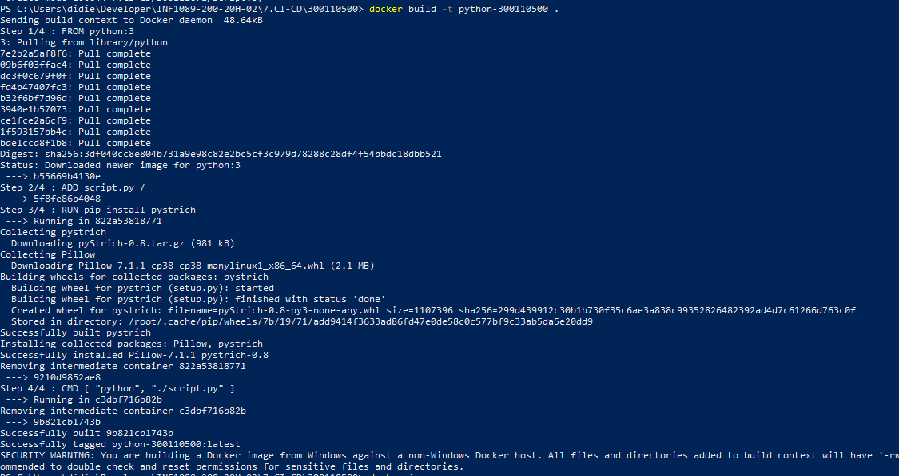
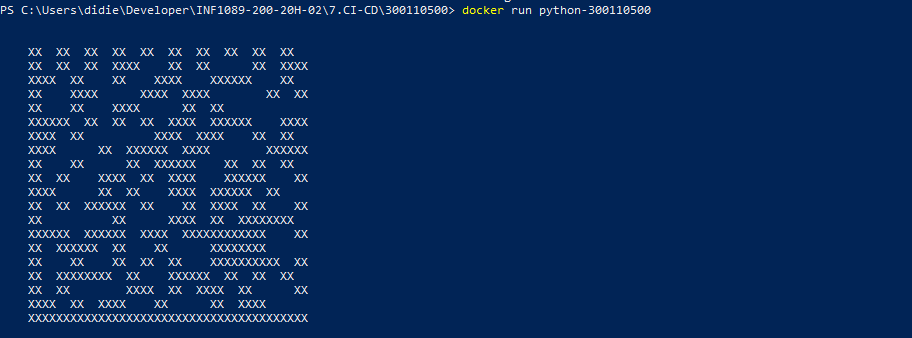

## Bienvenue dans "Bonjour Monde" avec GitHub Actions

Ce cours te guidera à écrire ta première action et à l'utiler avec un fichier de flux de tâches `workflow`. 

**Prêt à démarrer? Dirige toi vers le premier problème.**

# :seven: CI/CD Batch

Ce laboratoire t'apprendra à utiliser les commandes `shell` sous Unix en créant un fichier `entrypoint.sh`, à créer ton propre conteneur `Docker` en créant un fichier `Dockerfile` et t'apprendra les bases du [`CI/CD`](https://en.wikipedia.org/wiki/CI/CD) `Continuous Integration` et `Continuous Delivery` avec le service `github actions` de `github.com`.

Une section [Indices](#fire-indices) est fournie ci-dessous comme documentation d'aide à terminer ce laboratoire.

Tu pourras t'appuyer d'une documentation en ligne pour continuer ce labobratoire en améliorant le fichier `Dockerfile` avec le [cours en ligne suivant](https://www.linkedin.com/learning/docker-essential-training-3-image-creation-management-and-registry/analyzing-a-dockerfile)

## :a: :id:

* Créer un répertoire avec votre :id:

* Créer votre fichier `README.md`

```
$ touch README.md
```

[Participation](Participation.md)

## :b: Laboratoire

:one: Écrire les scripts en suivant le laboratoire ci-dessous dans [Github Leaning Lab](https://lab.github.com/CollegeBoreal):

https://lab.github.com/CollegeBoreal/lab-github-actions:-bonjour-monde


:two: Copier votre scripts dans le cours en remplaçant :id: par votre :id: github :octocat: :

https://github.com/:id:/lab-bonjour-github-actions

- [✔ ] Copier les scripts:

Par example:

  - [✔ ] Copier le fichier `Dockerfile` dans votre :id: `Boréal` 

  - [✔ ] Copier le fichier `entrypoint.sh` dans votre :id: `Boréal` 


- [✔  ] Modifie ton fichier README.md pour plus de documentation


En un mot, récupérer le travail que vous avez fait à travers [Github Leaning Lab](https://lab.github.com/CollegeBoreal) et le mettre dans celui du cours [7.CI-CD](../7.CI-CD)

:three: Amélioration

Le laboratoire vous garantit une note de :five::zero:`%`, ajouter du code en améliorant les scripts embellira la note.

En rappel, pour éxécuter localement son fichier `Dockerfile`, on execute la commande :

`$ docker build --tag b300110500:1.0 .`


`$ docker run --tty --env INPUT_MON_NOM="Draman" b`:id:`:1.0`

`Bonjour tout le monde mon nom est Draman`

Pour visualiser les couches images de l'image créée

`% docker image history b`:id:`:1.0`
```
IMAGE               CREATED             CREATED BY                                      SIZE                COMMENT
a555cf89a1b7        40 seconds ago      /bin/sh -c #(nop)  ENTRYPOINT ["/entrypoint.…   0B                  
4bb76bfb1e74        40 seconds ago      /bin/sh -c chmod +x /entrypoint.sh              65B                 
c010b45de5b3        40 seconds ago      /bin/sh -c #(nop) ADD file:44be7c7e599db7b1d…   65B                 
4e5021d210f6        2 weeks ago         /bin/sh -c #(nop)  CMD ["/bin/bash"]            0B                  
<missing>           2 weeks ago         /bin/sh -c mkdir -p /run/systemd && echo 'do…   7B                  
<missing>           2 weeks ago         /bin/sh -c set -xe   && echo '#!/bin/sh' > /…   745B                
<missing>           2 weeks ago         /bin/sh -c [ -z "$(apt-get indextargets)" ]     987kB               
<missing>           2 weeks ago         /bin/sh -c #(nop) ADD file:594fa35cf803361e6…   63.2MB   
```

# :fire: Indices 

Tu auras besoin de:

:round_pushpin: créer et manipuler une branche avec `git`:

https://github.com/CollegeBoreal/Tutoriels/tree/master/0.GIT/.branch

:one: Créer manuellement deux fichiers{docker fileet script}


:two: excecuter le docker avec la coomande ci-apres
> docker build -t python-300110500 .


:three:  lister les images
 > docker images


:four:  visualise les images avec docker run
 `> docker run python-300110500`
 

