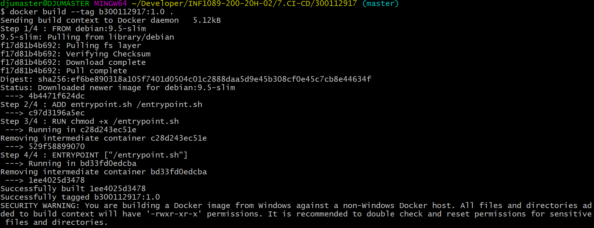
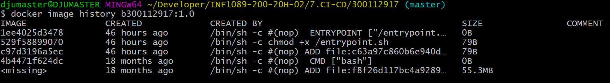

# :seven: CI/CD Batch

Ce laboratoire t'apprendra à utiliser les commandes `shell` sous Unix en créant un fichier `entrypoint.sh`, à créer ton propre conteneur `Docker` en créant un fichier `Dockerfile` et t'apprendra les bases du [`CI/CD`](https://en.wikipedia.org/wiki/CI/CD) `Continuous Integration` et `Continuous Delivery` avec le service `github actions` de `github.com`.

Une section [Indices](#fire-indices) est fournie ci-dessous comme documentation d'aide à terminer ce laboratoire.

Tu pourras t'appuyer d'une documentation en ligne pour continuer ce labobratoire en améliorant le fichier `Dockerfile` avec le [cours en ligne suivant](https://www.linkedin.com/learning/docker-essential-training-3-image-creation-management-and-registry/analyzing-a-dockerfile)

## :a: :id:

* Créer un répertoire avec votre 300112917

* Créer votre fichier `README.md`

```
$ touch README.md
```

[Participation](Participation.md)

## :b: Laboratoire

:one: Écrire les scripts en suivant le laboratoire ci-dessous dans [Github Leaning Lab](https://lab.github.com/CollegeBoreal):

https://lab.github.com/CollegeBoreal/lab-github-actions:-bonjour-monde


:two: Copier votre scripts dans le cours en remplaçant :id: par votre :id: github :octocat: :

https://github.com/:id:/lab-bonjour-github-actions

- [X] Copier les scripts:

Par example:

  - [X] Copier le fichier `Dockerfile` dans votre 300112917 `Boréal` 

  - [X] Copier le fichier `entrypoint.sh` dans votre 300112917 `Boréal` 


- [X] Modifie ton fichier README.md pour plus de documentation


En un mot, récupérer le travail que vous avez fait à travers [Github Leaning Lab](https://lab.github.com/CollegeBoreal) et le mettre dans celui du cours [7.CI-CD](../7.CI-CD)

:three: Amélioration

Le laboratoire vous garantit une note de :five::zero:`%`, ajouter du code en améliorant les scripts embellira la note.

En rappel, pour éxécuter localement son fichier `Dockerfile`, on execute la commande :

`$ docker build --tag b300112917:1.0 .`

</img>

`$ docker run --tty --env INPUT_MON_NOM="Draman" b300112917:1.0`

`Bonjour tout le monde mon nom est Draman`

Pour visualiser les couches images de l'image créée

`% docker image history b300112917:1.0`
```
IMAGE               CREATED             CREATED BY                                      SIZE                COMMENT
1ee4025d3478        46 hours ago        /bin/sh -c #(nop)  ENTRYPOINT ["/entrypoint.…   0B
529f58899070        46 hours ago        /bin/sh -c chmod +x /entrypoint.sh              79B
c97d3196a5ec        46 hours ago        /bin/sh -c #(nop) ADD file:c63a97c860b6e940d…   79B
4b4471f624dc        18 months ago       /bin/sh -c #(nop)  CMD ["bash"]                 0B
<missing>           18 months ago       /bin/sh -c #(nop) ADD file:f8f26d117bc4a9289…   55.3MB
  
```

</img>

# :fire: Indices 

Tu auras besoin de:

:round_pushpin: créer et manipuler une branche avec `git`:

https://github.com/CollegeBoreal/Tutoriels/tree/master/0.GIT/.branch

:round_pushpin: Créer une demande d'extraction `pull request` par le biais de l'interface web de github: 

https://help.github.com/en/github/collaborating-with-issues-and-pull-requests/creating-a-pull-request#creating-the-pull-request

:round_pushpin: Creér Répertoire Imbriqué

par exemple pour créer `.github/workflows` utilise la commande suivante avec le parametre `-p`:

```
$ mkdir -p .github/workflows
```
