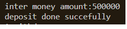
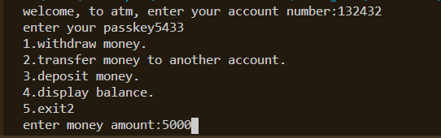
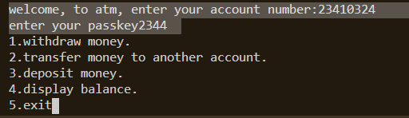
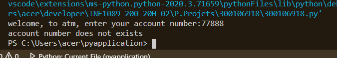

# ATM Machine


## :o: Description 

     # Programme python pour gérer ATM Machine, tout d'abord l'utilisateur 
      a besoin d'un mot de passe pour entrer dans le programme,
      alors une liste apparaît :
           1. retirer de l'argent.
           2. appuyez sur 2 pour transférer de l'argent.
           3. pour déposer de l'argent.
           4. pour afficher le solde actuel.

  - dépôt d'argent

    
 

  - transférer de l'argent

    


## :o: 
 
   
##### :m: input
          La fonction input() demande un argument (qui peut être vide) qui est de type chaîne de caractère. 
          Elle attend que l'utilisateur frappe quelque chose au clavier. Elle renvoie une valeur de type
          correspondant à ce qui a été frappé au clavier         
 ''
 - Le même cas dans le programme l’utilisateur tape le numéro de compte et le mot de passe

''
 

''
    :star: Syntax

          input(prompt) 
          Parameter Values

          Parameter       Description
          Prompt              A String, representing a default message before the input


''
    :star: Les index

         le programme utilise Les index de liste de -x signifient le xth élément de la fin de la liste, donc n [-1] 
         signifie le dernier élément de la liste n.

          En termes simples, la méthode index () trouve l'élément donné dans une liste et renvoie sa position.
          Si le même élément est présent plusieurs fois, la méthode renvoie l'index de la première occurrence de l'élément.
 
                       if accounts.current_user_index==-1:
                           print('account number does not exists')
              

##### :m: Les boucle
  ''
         :star: Les boucles permettent d'exécuter plusieurs fois les mêmes ordres

        ● Pour parcourir une liste :

            for variable in liste:
               code de la boucle
                                    list1 = ["a", "b" , "c"]
                                    list2 = [1, 2, 3]
                                       for x in list2:
                                           list1.append(x)
                                       print(list1)


''
      :star: while  Le principe de la boucle while, c’est d’exécuter un bloc d’instructions
         tant qu’une condition donnée est vraie. 

              while nom_variable = valeur:
                    instructions
                    modification de variable

##### :m: instruction conditionnelle
''        
       :star:  if  dans le cas où elle l'est, à effectuer un traitement spécifique, 
         et si elle ne l'est pas à effectuer un autre traitement else 

             if condition: 
                 exécuté si condition est vraie 
            [else: 
                 exécuté si condition est fausse]


##### :m:  l’instruction + break + 
             vous offre la possibilité de sortir d’une boucle lorsqu’une condition externe
             est déclenchée sert, non pas à interrompre le programme, mais à sortir de la boucle.
             
             La boucle for  parcoure un bloc de code qui contiens des numéro de comptes si un numéro de compte
             est trouver correcte  l'instruction break mettra fin à la boucle si non la boucle tourne  
             print('account number does not exists')  si un numéro de compte incorrecte ou non trouver 



##### :m:  elif 
      Le mot clé elif est un raccourci pour else if, mais permet de gagner un niveau d’indentation.

 :star:Autrement 

        L'instruction elif est une compression de else if qui signifie sinon si. 
        Elle doit être utilisée après un if ou un autre elif. 
        

        
        


##### :m: Stats

```
```

##### :m: E


##### :m: d

```
```


##### :m:  use

```
```

##### :m:  m

```
```
=======

>>>>>>> 81f66
