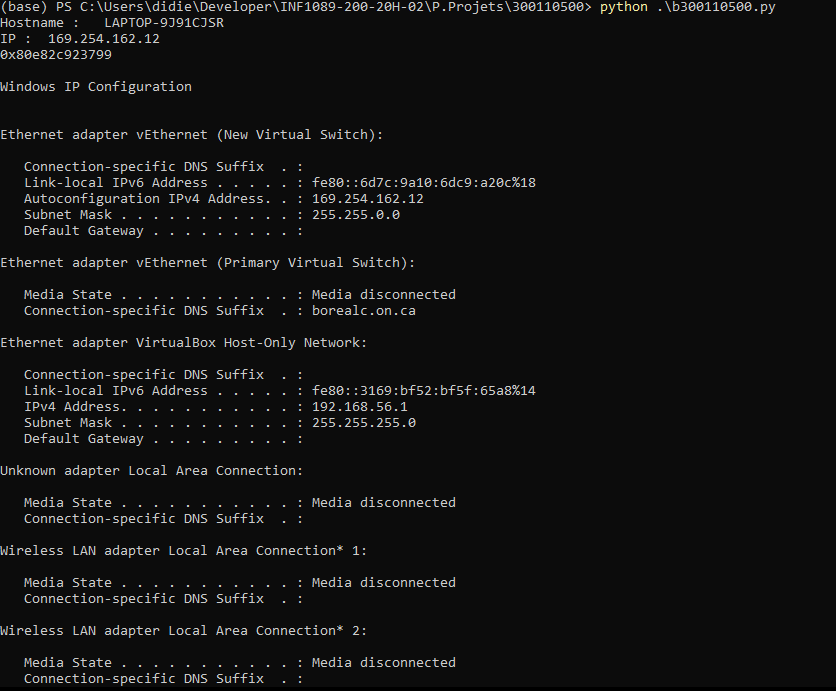

# 🎈 Mon premier script en python  :snake:

## Python3 code: ADMINISTRER SON RESEAU AVEC UN SCRIPT PYTHON 👇
```
En windows CMD, plusieurs commandes permettent d'afficher les parametres du reseau, et 
faire des pings pour tester la connectivite de son hote. 
De meme en pyrhon des scripts peuvent etre utilises pour obtenir le memes resultat.
Pour mon cas j'ai realiser un script qui permet afficher le nom d'hote et l'addresse IP de son ordinateur 
ainsi que les information de configuration  configuration de mon reseau .
Le processus de ce script suit plusieurs processus les etapes suivante.
```
### :one: Importation du socket library  👇
import socket
What is socket?
```
Deriver du mot anglais, socket est un trou qui laisse passer des choses,comme une prise electrique ou une bouche.
Pour notre cas il designe une associationau niveau de l'IOS entre un programme qui tourne en boucheet et 
le port de la machine qui lui a ete dedie.
En un mot  importer le socket c'est faire communiquer deux noeuds a un reseau c'est a dire le port et l'ip
```
### :two: Definir la fonction et ses parametres tels que le nom d'hote et IP address  👇
 En programmation python les fonction sont utiles pour realiser plusieurs fois la meme operation.
 Elle rend le code plus lisible et clair en le fonctionnant en bloc logiques.
 D'ou la representation de la fonction de facon suivante:
 def nomDeLaFonction(liste de param�tres):
 ````
    ...
    bloc d'instructions
    ...
Voici le nom de la fonction et les parametres de ip address et hostname
def get_Host_name_IP(): 
    try: 
        host_name = socket.gethostname() 
        host_ip = socket.gethostbyname(host_name) 
 ````
### :three: Appel de la foction  👇
L'appel d'une fonction qui renvoie une valeur est une expression, et on peut dès lors l'utiliser partout 
là où une expression est acceptée. 

```
        print("Hostname :  ",host_name) 
        print("IP : ",host_ip) 
     except: 
        print("Unable to get Hostname and IP") 
 get_Host_name_IP() #Function call 
 ````
### :four: Script d'affichage partiel  👇

```
get_Host_name_IP() ]
  
import socket 
def get_Host_name_IP(): 
    try: 
        host_name = socket.gethostname() 
        host_ip = socket.gethostbyname(host_name) 
        print("Hostname :  ",host_name) 
        print("IP : ",host_ip) 
    except: 
        print("Unable to get Hostname and IP") 
  
get_Host_name_IP()
```
### :five: Ajouter un UUID pour generer l'adreese MAC  👇

UUID, Universal Unique Identifier, est une bibliotheque python qui aide à generer des objets aeéatoires
de 128 bits comme identifiants. Il fournit l'unicité car il genere des identifiants en fonction du temps,
du matériel informatique (MAC, etc.).

A la fonction principale nous pouvons inserer le second module 
````
import uuid 
print (hex(uuid.getnode())) 
````
 ### :six: importation  d'un dernier module supprocess 👇
Le module subprocess vous permet de lancer de nouveaux processus, les connecter a des
tubes d'entree/sortie/erreur, et d'obtenir leurs codes de retour. 
Ce module a l'intention de remplacer plusieurs anciens modules et fonctions os.system.\

```
WARNING: Utiliser ipconfig ou ifconfig selon votre os
import subprocess
proc = subprocess.check_output("ipconfig" ).decode('utf-8')
print (proc)
````
### :seven: Output 👇


````

