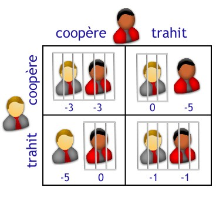

   # 👉 Mon Projet                         
    
  # _Le dilemme du prisonnier_
  
  ## règles du jeu
       
  _Dans le jeu du « dilemme du prisonnier », deux détenus sont emprisonnés dans des cellules
séparées. La police fait à chacun des deux le même marché :
« Tu as le choix entre dénoncer ton complice ou non. Si tu le dénonces et qu'il te dénonce aussi,
vous aurez une remise de peine d'un an tous les deux. Si tu le dénonces et que ton complice te
couvre, tu auras une remise de peine de 5 ans (et tu seras libéré), mais ton complice tirera le
maximum. Mais si vous vous couvrez mutuellement, vous aurez tous les deux une remise de peine
de 3 ans. »_

</img>

_Dans cette situation, il est clair que si les détenus s'entendent, ils s'en tireront globalement mieux
que si l'un trahit l'autre. Mais l'un peut être tenté de s'en tirer encore mieux en trahissant son
complice. Craignant cela, l'autre risque aussi de trahir son complice pour ne pas être le dindon de la
farce. Le dilemme est donc : « faut-il coopérer avec son complice (et donc le couvrir) ou non ? »
Le dilemme du prisonnier devient plus intéressant et plus réaliste lorsque la durée de l'interaction
n'est pas connue. On peut alors envisager de se souvenir du comportement d'un joueur à son égard et
développer une stratégie en rapport. Par exemple, si je sais que mon adversaire ne coopère jamais,
mon intérêt de ne pas coopérer non plus, sous peine d'être systématiquement grugé. Par contre, si je
sais que mon adversaire coopérera toujours quoi qu'il arrive, j'aurai intérêt à être vicieux et ne jamais
coopérer pour maximiser mon gain._

   ## 💨 Exemple de partie

Coups et score du joueur Donnant donnant

  ['C', 'T', 'T', 'T', 'T', 'C', 'T', 'C', 'T', 'T']

  19

 Coups et score du joueur Aléatoire

  ['T', 'T', 'T', 'T', 'C', 'T', 'C', 'T', 'T', 'C']

  19

   ## ✔ Analyse du programme
   
   _La première partie du programme ne présente rien de nouveau : on définit les gains et les
stratégies des joueurs (les noms des stratégies sont données par les noms des joueurs)._

### La grande nouveauté apparaît avec les dictionnaires :
```
liste = {}
score = {}
```

### 👍 On crée d'abord deux dictionnaires : 
_liste donnant la liste des coups joués par les joueurs,et score donnant leur score respectif._

### 👁 On initialise ensuite les deux listes de coups :
```
liste['Aléatoire'] = []
liste['Donnant donnant'] = []
```
### 💥 puis on met les scores à 0 :
```
for joueur in liste.keys():
score[joueur] = 0
```
### 😁 Enfin, le duel commence et durera nb_total_coups :
```
nb_coups = 0
nb_total_coups = 10 # à modifier
while nb_coups < nb_total_coups :
```

💲 Chaque joueur joue selon sa stratégie en tenant compte des coups précédents (le premier
paramètre est la liste des coups de l'adversaire, le second la liste des coups du joueur) :
```
coup_joueur1 = aleatoire(liste['Donnant donnant'],liste['Aléatoire'])
coup_joueur2 = donnant_donnant(liste['Aléatoire'],liste['Donnant donnant'])
```

### 🚗 On ajoute ce coup à la liste des coups :
```
liste['Aléatoire'].append(coup_joueur1)
liste['Donnant donnant'].append(coup_joueur2)
```

### 🔎 puis on met à jour les scores et on recommence pour le coup suivant :
```
score['Aléatoire'] += gain(coup_joueur2,coup_joueur1)
score['Donnant donnant'] += gain(coup_joueur1,coup_joueur2)
nb_coups += 1
```

### 🤦‍♀️On affiche finalement les coups joués lors du duel et les scores des deux joueurs :
```
for joueur in liste.keys():
print("Coups et score du joueur",joueur)
print(liste[joueur])
print(score[joueur])
print()
```
