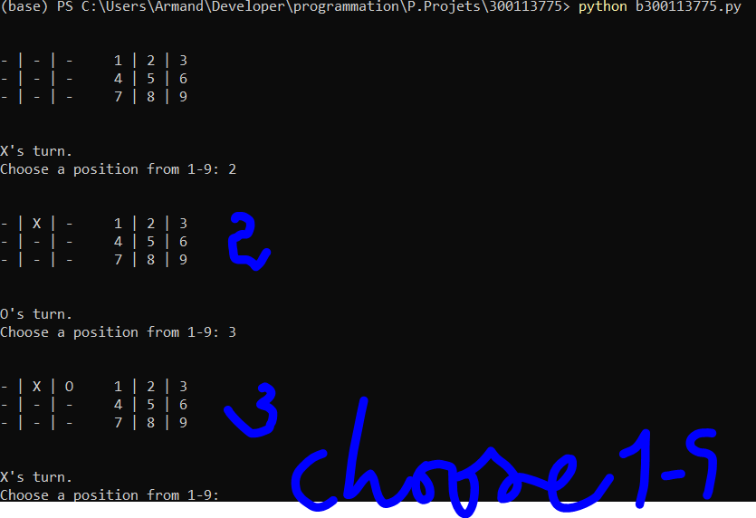

###  Programmtion du jeu tic tac toe avec python 

Tout d'abord je crée un tableau 

```
board = ["-", "-", "-",
         "-", "-", "-",
         "-", "-", "-"]
```

Ensuite une focntion qui affiche ce tableau en les attribuant 1à 9

```
def display_board():
  print("\n")
  print(board[0] + " | " + board[1] + " | " + board[2] + "     1 | 2 | 3")
  print(board[3] + " | " + board[4] + " | " + board[5] + "     4 | 5 | 6")
  print(board[6] + " | " + board[7] + " | " + board[8] + "     7 | 8 | 9")
  print("\n")
```

en outre je lance avec une fonction play 

#### au final je vérifie si c'est une entree valide 
```
# Handle a turn for an arbitrary player
def handle_turn(player):

  # Get position from player
  print(player + "'s turn.")
  position = input("Choose a position from 1-9: ")

  # Whatever the user inputs, make sure it is a valid input, and the spot is open
  valid = False
  while not valid:

    # Make sure the input is valid
    while position not in ["1", "2", "3", "4", "5", "6", "7", "8", "9"]:
      position = input("Choose a position from 1-9: ")
 
    # Get correct index in our board list
    position = int(position) - 1

    # Then also make sure the spot is available on the board
    if board[position] == "-":
      valid = True
    else:
      print("You can't go there. Go again.")

  # Put the game piece on the board
  board[position] = player

  # Show the game board
  display_board()

```

## Verification s'il y a un gagant (pour qu'il y ait un gagnant 3 (X) ou 3 (0) doivent etre aligner 
donc je cree 3 autres fonctions qui verifieront  les : lignes, les colonnes , et les diagonales .

```
# Check the rows for a win
def check_rows():
  # Set global variables
  global game_still_going
  # Check if any of the rows have all the same value (and is not empty)
  row_1 = board[0] == board[1] == board[2] != "-"
  row_2 = board[3] == board[4] == board[5] != "-"
  row_3 = board[6] == board[7] == board[8] != "-"
  # If any row does have a match, flag that there is a win
  if row_1 or row_2 or row_3:
    game_still_going = False
  # Return the winner
  if row_1:
    return board[0] 
  elif row_2:
    return board[3] 
  elif row_3:
    return board[6] 
  # Or return None if there was no winner
  else:
    return None


# Check the columns for a win
def check_columns():
  # Set global variables
  global game_still_going
  # Check if any of the columns have all the same value (and is not empty)
  column_1 = board[0] == board[3] == board[6] != "-"
  column_2 = board[1] == board[4] == board[7] != "-"
  column_3 = board[2] == board[5] == board[8] != "-"
  # If any row does have a match, flag that there is a win
  if column_1 or column_2 or column_3:
    game_still_going = False
  # Return the winner
  if column_1:
    return board[0] 
  elif column_2:
    return board[1] 
  elif column_3:
    return board[2] 
  # Or return None if there was no winner
  else:
    return None


# Check the diagonals for a win
def check_diagonals():
  # Set global variables
  global game_still_going
  # Check if any of the columns have all the same value (and is not empty)
  diagonal_1 = board[0] == board[4] == board[8] != "-"
  diagonal_2 = board[2] == board[4] == board[6] != "-"
  # If any row does have a match, flag that there is a win
  if diagonal_1 or diagonal_2:
    game_still_going = False
  # Return the winner
  if diagonal_1:
    return board[0] 
  elif diagonal_2:
    return board[2]
  # Or return None if there was no winner
  else:
    return None
```

### et s'il n'y a pas de ganant c'est une egalite 
```
# Check if there is a tie
def check_for_tie():
  # Set global variables
  global game_still_going
  # If board is full
  if "-" not in board:
    game_still_going = False
    return True
  # Else there is no tie
  else:
    return False

```

### au cours du jeu il faut changer de joueur après chaque tour  

```
# Flip the current player from X to O, or O to X
def flip_player():
  # Global variables we need
  global current_player
  # If the current player was X, make it O
  if current_player == "X":
    current_player = "O"
  # Or if the current player was O, make it X
  elif current_player == "O":
    current_player = "X"

```


J'utilise VS CODE pour tester . il marche aussi avec "python main.py" sur anaconda powershell



